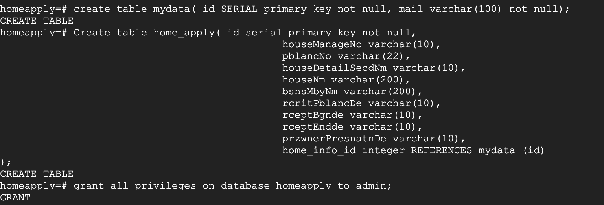

# GCP와 Docker활용한 PostgreSQL 사용하기

>참고문서
https:/hihellloitland.tistory.com/93
https:/xeppetto.github.io/%EC%86%8C%ED%94%84%ED%8A%B8%EC%9B%A8%EC%96%B4/WSL-and-Docker/15-Docker-PostGreSQL/
https:/d2.naver.com/helloworld/227936

# 들어가면서
관계형 DBMS는 많은 시스템이 존재한다. 이중에서 postgreSQL은 북미와 일본에서 많은 인지도를 가지고 있다. 실제 기능 면에선 OpenSQL과 같은 기능을 최대한 많이 적용하는 DBMS이기에 쉽게 적응하기 쉬운 DB라고 볼 수 있다.

https:/ko.wikipedia.org/wiki/PostgreSQL 

# GCP내 VM에서 Docker로 PostgresDB 운영하기
최근에 토이프로젝트를 제작하면서, GCP 내의 Micro 서버를 운영중인데, 여기다가 PostgreDB를 추가했다. 사실 외부에서 추가해도 되지만, 아무래도 capacity가 작은 서비스이기에 먼저 여기서 운영해보고, 유입량이 많아지면 차차 마이그 작업을 진행하려고한다. 

## docker 상에서 postgres 이미지 받기
~~~
> docker pull postgres
~~~

## docker 인스턴스로 올리기
- docker run : docker image에서 container를 생성
- –name PostgresDB : container의 이름은 PostgresDB 설
- -p 5432:5432 : 해당 container의 port forwarding에 대해 inbound/outbound port 모두 5432으로 설정한다.
- -e : container 내 변수를 설정한다.
- POSTGRES_PASSWORD=”암호” : ROOT 암호를 설정 
- -d postgres : postgres이라는 이미지에서 분리하여 container를 생성

## docker 프로세스 확인

## postgresDB 컨테이너 내 bash 연결

## DB 생성 및 DB 커넥션
- mysql에선 use DB가 postgres에선 \c로 사용.
- mysql에선 decribe table 이 postgres에선 \d 혹은 \d+ 테이블명으로 사용.

## 유저 계정 생성 및 DB 권한 부여

## 테이블 생성

## error: permission denied for table 발생시 대처 방법

## 정상 연계 확인

## javascript 샘플 코드

### dbconfig.js
~~~ javascript
require('dotenv').config();

exports.dbconfig = { 
    host: process.env.DB_HOST, 
    user: process.env.DB_USER,
    password: process.env.DB_PW, 
    database: process.env.DB_NAME, 
    port:  process.env.DB_PORT,
    max : process.env.DB_MAX,
    idleTimeoutMillis : process.env.DB_IDLE
}
~~~

### Repository.js

~~~ javascript

const { dbconfig } = require('./dbconfig'); 
const pq = require('pg');

const pool = new pq.Pool(dbconfig);

/insert mydata
/select mydata by user-email
/update mydata
/delete mydata

const sqlexecute = async function(query, param){
  const res = await pool
  .connect()
  .then(client => {
    return client
    .query(query, param)
        .then(res => {
          client.release();
          return res;
      })
      .catch(err => {
        client.release();
        console.error(err.stack);
        return err.stack;
      })
  });
  return res;
}

module.exports = sqlexecute;

~~~
